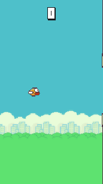

# Flappy Bird RL

A Flappy Bird environment built to the [Gymnasium](https://gymnasium.farama.org/)
API, and a PPO agent that learns to play it. The trained policy is committed, so
the demo runs on a fresh clone without training anything.

<p align="center">
  
</p>

**[▶ Play the live demo](https://moralesangel.github.io/flappy-bird-rl/)** — the
trained policy running in your browser, no install required.

**Trained agent: 171.7 pipes on average over 30 held-out seeds** (median 156).

```bash
pip install -r requirements.txt
python play.py            # watch the trained agent
python play.py --human    # play it yourself (SPACE)
```

---

## An ablation, and a negative result

During development the agent plateaued around 13 pipes. Logging death states
(position, velocity, and which pipe was hit) showed a consistent failure: the
bird falling at terminal velocity with the gap below it, unable to reach the
opening in time.

That suggested a partial-observability problem. Consecutive gap centres can
differ by up to 256 px while the bird has only ~53 steps between pipes, so
covering that distance takes most of the available window — the agent has to
start moving before the relevant pipe is observable. The environment exposed
only the *next* pipe, so I added two features describing the pipe after next.
Performance improved substantially, and the obvious conclusion was that the
extra features fixed it.

**They did not.** Testing that properly showed the improvement came from
training longer, not from the added inputs. `experiments/ablation_lookahead.py`
masks the two lookahead features to zero and holds physics, reward, network,
seeds and step budget fixed:

| Arm | seed 0 | seed 1 | seed 2 | Mean |
|---|---|---|---|---|
| With lookahead (7 features) | 16.9 | 18.6 | 12.9 | **16.1** |
| Without lookahead (5 features) | 18.9 | 14.8 | 20.6 | **18.1** |

Mean pipes over 30 held-out seeds, 2M steps per arm. The difference is not
significant (p ≈ 0.46), and the direction flips between seeds. The original
comparison was confounded: the observation change coincided with a much longer
training run, and the step budget — not the features — accounted for the gain.

The 7-feature observation is kept because it is better motivated by the physics
and costs nothing, but this repo does not claim it helps, because the measurement
does not support that.

*Caveat, stated because it matters:* the `with_lookahead` seed-2 run completed
1.5M steps rather than 2M after a process was killed; the other five runs used
the full 2M. Three seeds is also a small sample for a null result — it rules out
a large effect, not a small one. Raw numbers are in
`experiments/ablation_results.json`.

---

## Results

Evaluated with `python evaluate.py --episodes 30` on seeds 900–929, which are
never used during training.

| Metric | Value |
|---|---|
| Mean pipes cleared | **171.7** |
| Median | 156 |
| Min / Max | 1 / 367 |
| Episodes hitting the 20k-step cap | 5 / 30 |

Reported honestly: the maximum of 367 is the evaluation step cap, not a death,
so it is a floor rather than the policy's ceiling. Performance is also bimodal —
a few seeds still end early, which is where the remaining headroom is.

Training used PPO (`MlpPolicy`) for ~7M steps across 8 parallel environments,
about 5,500 steps/second on CPU.

---

## The environment

`FlappyBirdEnv`, registered as `FlappyBird-v0`. It passes
`gymnasium.utils.env_checker.check_env` and is deterministic given a seed.

| | |
|---|---|
| **Action** | `Discrete(2)` — 0 = do nothing, 1 = flap |
| **Observation** | `Box(7,)`, normalised to roughly `[-1, 1]` |
| **Reward** | +0.1 per step survived, +1.0 per pipe passed, −1.0 on death |
| **Termination** | Collision with a pipe, the ground, or the ceiling |
| **Truncation** | After `max_steps` (default 10,000) |

The observation is a feature vector rather than raw pixels, so an MLP policy
trains in minutes on CPU instead of hours on a GPU:

| # | Feature |
|---|---|
| 0 | Bird y position |
| 1 | Bird vertical velocity |
| 2 | Horizontal distance to the next pipe |
| 3 | Vertical offset to the top of the next gap |
| 4 | Vertical offset to the bottom of the next gap |
| 5 | Horizontal distance to the pipe after next |
| 6 | Vertical offset to the centre of the gap after next |

Feature 5 is scaled by `WIDTH + PIPE_SPACING` rather than `WIDTH`; normalising by
screen width alone left it saturated at 1.0 for most of each cycle, wasting the
input.

### Physics

Fixed timestep at 30 steps/second, so each `step()` is a reproducible unit of
time and runs are comparable across machines.

| | Value |
|---|---|
| Gravity | 0.4 px/step² |
| Flap velocity | −7.0 px/step |
| Terminal fall speed | 10.0 px/step |
| Pipe speed | 3.0 px/step |
| Pipe spacing | 160 px (≈53 steps) |
| Gap | 128 px, bird diameter 24 px → 104 px of usable band |

Collision is a circle-vs-rectangle test against each pipe half. An earlier
square-hitbox version rejected valid near-edge passes, which capped achievable
scores before any learning was involved.

---

## Repository layout

```
flappy_env.py                     the Gymnasium environment
train.py                          PPO training entry point
evaluate.py                       held-out evaluation
play.py                           interactive play, menus, game-over screen
export_policy.py                  exports the actor to docs/policy.json
record_demo.py                    renders docs/demo.gif
experiments/
  ablation_lookahead.py           the observation-space ablation
  ablation_results.json           its raw output
docs/                             the GitHub Pages demo
  index.html                      page and render loop
  game.js                         JS port of the env + the actor forward pass
  policy.json                     exported weights and env constants
assets/                           sprites
ppo_flappy.zip                    trained policy (committed)
```

Menus and the game-over card live in `play.py`, not the environment, so
`env.step()` never emits a frame the agent does not act on.

---

## The browser demo

The trained policy is a 7→64→64→2 MLP with tanh activations. Only the actor
path matters for inference, which is 4,802 parameters — small enough that the
demo ships the weights as JSON and does the forward pass in plain JavaScript.
There is no TensorFlow.js, ONNX runtime or WASM blob; `docs/game.js` is a few
dozen lines of loops over `Float64Array`.

`export_policy.py` writes both the weights and the environment constants into
`docs/policy.json`, so the browser never hardcodes a number that Python also
owns — a physics constant can only drift in one place.

The port was checked against the Python implementation rather than eyeballed:
a 300-step reference trace of `(observation, action)` pairs from the trained
model reproduces with **zero action mismatches** in JavaScript. Pipe layouts do
differ, since the Python env seeds a Mersenne Twister that the browser does not
reproduce, but the policy is a function of the observation and not of the
layout, so behaviour is preserved — the JS build scores a comparable 125.8 mean
over 15 browser seeds.

---

## Usage

```bash
# Train from scratch (writes ppo_flappy.zip)
python train.py --timesteps 2000000

# Evaluate on held-out seeds
python evaluate.py --episodes 30

# Reproduce the ablation
python experiments/ablation_lookahead.py --timesteps 2000000 --seeds 0 1 2

# Re-record the demo GIF
python record_demo.py
```

`play.py` opens on the title card; SPACE starts and restarts, ESC quits. Pass
`--episodes N` to skip the menus for scripted runs.

Training logs to `./tb_logs`: `tensorboard --logdir tb_logs`

---

## Notes

Reward is +0.1 per step and +1.0 per pipe. The survival term is what gets
learning off the ground — with a pipe-only reward the signal is too sparse early
on, since a random policy rarely reaches the first pipe.

Sprites are from the widely circulated Flappy Bird clone asset set, used here for
a non-commercial educational project. The code is MIT licensed; the artwork is
not mine.
